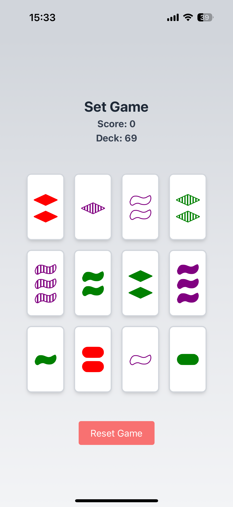

# 🃟 Set Game

A beautiful and interactive implementation of the classic **SET** card game, built with **React**, **TypeScript**, and **Tailwind CSS**.  
Sharpen your pattern recognition skills in this fun and challenging logic game!

---

## 🧠 What is SET?

**SET** is a card game where players try to identify a "set" of three cards that satisfy specific rules based on four features:
- **Color**: red, green, or purple
- **Shape**: oval, squiggle, or diamond
- **Shading**: solid, striped, or outlined
- **Number**: 1, 2, or 3

For a valid **set**, each feature must be **either all the same or all different** across the three cards.

---

## 🚀 Features

✅ Fully functional SET game logic  
✅ Valid set detection and scoring system  
✅ Dynamic board that replaces matched sets with new cards  
✅ Toast notifications when game finished 
☑️ Built with performance and clarity in mind  
✅ Tailwind-powered clean UI with custom card shapes as svgs

---

## 🖥️ Tech Stack

- ⚛️ [React](https://react.dev/)
- 💅 [Tailwind CSS](https://tailwindcss.com/)
- 🧠 Type-safe game logic with [TypeScript](https://www.typescriptlang.org/)
- ⚡ [Vite](https://vitejs.dev/) for ultra-fast development
- 🔥 [React Toastify](https://fkhadra.github.io/react-toastify/) for user notifications

---

## 📁 Project Structure

```
set-app/
├── public/                  # Public assets
├── src/
│   ├── assets/shapes/       # SVG-based card shapes
│   ├── components/          # UI components like Card and Board
│   ├── hooks/useSetGame.ts  # Main game logic using React hooks
│   ├── gameLogic.ts         # Core game rules and helper functions
│   ├── App.tsx              # App entry point
│   └── index.css            # Tailwind CSS
├── index.html               # HTML template
├── tailwind.config.js       # Tailwind config
├── vite.config.ts           # Vite config
└── tsconfig*.json           # TypeScript configurations
```

---

## 🎮 Gameplay Overview

- The board starts with **12 cards** randomly drawn.
- There is **always at least one valid set** on the board.
- Select **3 cards** to check if they form a valid set.
- If valid:
  - 🎉 Score increases
  - The cards are replaced from the deck
- If no sets are possible and the deck is not empty:
  - 3 more cards are drawn
- Game ends when **no more sets can be made** and the deck is empty.

---

## 🧪 Development

To run the project locally:

```bash
# 1. Clone the repository
git clone https://github.com/lukaszwaller/set-app.git
cd set-app

# 2. Install dependencies
npm install

# 3. Start the development server
npm run dev
```

---

## 📦 Production Build

```bash
npm run build
npm run preview
```

---

## 📷 Screenshots

### 💻 Desktop

<p align="center">
  
</p>

### 💻 PWA on iOS

<p align="center">
  
</p>

---

## 🔐 Accessing the App

The app is deployed via AWS CloudFront and protected by a CloudFront Function that checks Authorization headers and blocks unauthorized access.

### 🌍 Live URL
🔗 [set-game.online](https://set-game.online)

🔑 Authentication
You will be prompted for a username and password when visiting the app.

If you do not have credentials, please contact [Me](mailto:contact@lukas-zwaller.com).

---

## 🤝 Contributing

Contributions and improvements are welcome!  
Open an issue, submit a PR, or fork the project and make it your own 🎨

---

## 📄 License

MIT License © 2025 [Lukas Zwaller]

---

## 🌟 Acknowledgements

- Original game by **Marsha Jean Falco**
- Inspired by the love of logic games and clean UI design

---

> _"The joy of SET comes from the logic... and the speed."_ 🧩
